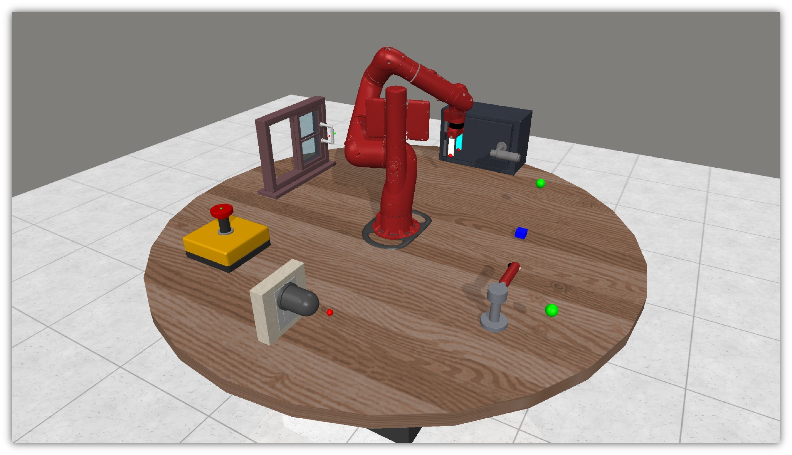

<div align="center">

# Continual Bench

</div>

<p align="center">
  
</p>

Continual Bench provides an environment suitable for evaluating online reinforcement learning agents under the continual learning setup, with a unified world dynamics.

## Installation

```console
git clone git@github.com:lkevinzc/continual-bench.git && cd continual-bench
pip install -e .
```

## Usage

```python
from continual_bench.envs import ContinualBenchEnv

env = ContinualBenchEnv(render_mode="rgb_array", seed=0)
action = ...
next_obs, reward, terminated, truncated, info = env.step(action)
```

## License

`continual-bench` is distributed under the terms of the [MIT](https://spdx.org/licenses/MIT.html) license.

## Citation

If you find our works useful for your research, please consider citing:

```bibtex
@inproceedings{liu2025continual,
  title={Continual Reinforcement Learning by Planning with Online World Models},
  author={Liu, Zichen and Fu, Guoji and Du, Chao and Lee, Wee Sun and Lin, Min},
  booktitle={International Conference on Machine Learning},
  year={2025}
}
```
